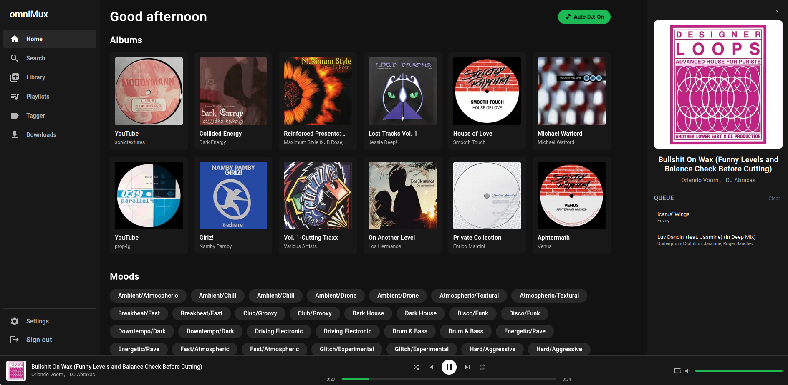

# omniMux

[](https://github.com/usr-wwelsh/vitalSVG) [](https://github.com/usr-wwelsh/vitalSVG) [](https://github.com/usr-wwelsh/vitalSVG) [](https://github.com/usr-wwelsh/vitalSVG)
[](https://github.com/usr-wwelsh/vitalSVG) [](https://github.com/usr-wwelsh/vitalSVG)

A self-hosted music server that lets you search YouTube, cache tracks to your library, and stream everything through a Spotify-like PWA. Built on top of [Navidrome](https://www.navidrome.org/) with a FastAPI middleware layer and a SvelteKit frontend.



## Features

- **YouTube search** — find tracks and cache them locally; Topic channel results are ranked first
- **Album detection** — open any album in your library and see missing tracks found on YouTube, with one-click import
- **Artist pages** — browse an artist's local albums alongside their full YouTube discography
- **Playlist import** — paste a YouTube playlist URL to queue all tracks and automatically create a matching Navidrome playlist as downloads complete
- **Mood analysis** — every downloaded track is analysed for mood, BPM, energy and key using [mood-detector](https://github.com/usr-wwelsh/mood-detector)
- **Shuffle & loop** — shuffle queue, loop all, or loop one track
- **PWA** — installable on desktop and mobile; responsive layout with a mobile mini-player (HTTPS required for install outside localhost — use a reverse proxy with TLS or a tunnel like Cloudflare Tunnel)
- **Server-side search cache** — YouTube results are cached in memory (1 h for tracks, 2 h for albums) so repeated searches are instant

## Stack

| Layer | Tech |
|---|---|
| Music server | Navidrome (Subsonic API) |
| API | Python · FastAPI · yt-dlp · mutagen |
| Frontend | SvelteKit 5 · TypeScript |
| Audio analysis | mood-detector |
| Infrastructure | Docker Compose |

## Quick start

**Prerequisites:** Docker and Docker Compose.

```bash
git clone https://github.com/usr-wwelsh/music-server.git
cd music-server
```

Edit `docker-compose.yml` and set a real value for `JWT_SECRET`, then:

```bash
docker compose up -d
```

| Service | URL |
|---|---|
| Web app | http://localhost:8801 |
| API | http://localhost:8800 |
| Navidrome | http://localhost:4533 |

On first run, open Navidrome at `:4533`, create an admin account, then log into the omniMux web app with those same credentials.

## Configuration

All configuration is via environment variables in `docker-compose.yml`:

| Variable | Default | Description |
|---|---|---|
| `NAVIDROME_URL` | `http://navidrome:4533` | Internal URL of the Navidrome service |
| `MUSIC_DIR` | `/music` | Where downloaded audio files are stored |
| `DATA_DIR` | `/data` | Where the SQLite database is stored |
| `JWT_SECRET` | `change-me-in-production` | Secret used to sign auth tokens — **change this** |

## Project structure

```
music-server/
├── api/                  # FastAPI backend
│   ├── routers/          # auth, search, download endpoints
│   ├── services/         # youtube, navidrome, download worker, cache
│   └── db/               # SQLAlchemy models + async SQLite
├── web/                  # SvelteKit PWA
│   └── src/
│       ├── routes/       # pages (search, library, artist, album, playlists, browse)
│       ├── components/   # Player, MiniPlayer, AlbumCard, TrackList, …
│       └── lib/          # subsonic.ts, api.ts, player store
└── docker-compose.yml
```

## License

[MIT](LICENSE) © usr-wwelsh
